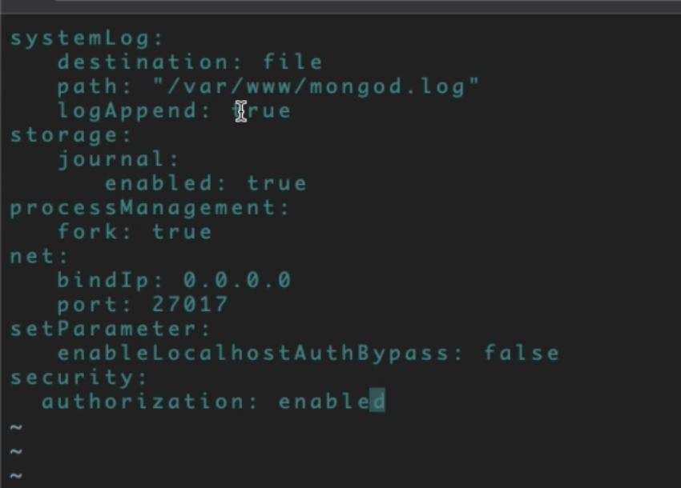

# Mongo Installation and Configuration

mongo.com/download-center

```sh
apt-get install redis-server
cd /etc/redis/
vi redis.conf
service redis-server start
redis cli <fqdn>
```

```service redis-server start```


@THIS POINT MYSQL IS WORKING / NGINX / PHPMYADMIN && REDIS
******>>>>> 
trying mongod: 

```sh
make /var/www/mongodb.log  REMOVE 127.0.0.1 from /etc/mongod.conf 
mongod --fork --logpath /var/www/mongod.log   --config /etc/mongo.conf --auth
@xbin>mongod --fork --logpath /var/www/mongod.log   --config /var/www/mongo.conf --auth
```

### MONGO WORKING @THIS Point

```sh
db.createUser({
    user: "mongod",
    pwd: "SOMEHARDPASSWORD",
    roles: [
              { role: "userAdminAnyDatabase", db: "admin" },
              { role: "readWriteAnyDatabase", db: "admin" },
              { role: "dbAdminAnyDatabase", db: "admin"},
              { role: "clusterAdmin", db: "admin" }
           ]
})
```

```sh
ln -s /var.www/mongo/bin/mongod /usr/sbin

mkdir /data
mkdir /data/db/
touch /var/www/mongod.conf
```


mongod --fork --logpath /var/www/mongod.log --config /var/www/mongo.conf --auth

 service  ssh start

docker commit <docker id> pr0conJayne/ubuntu